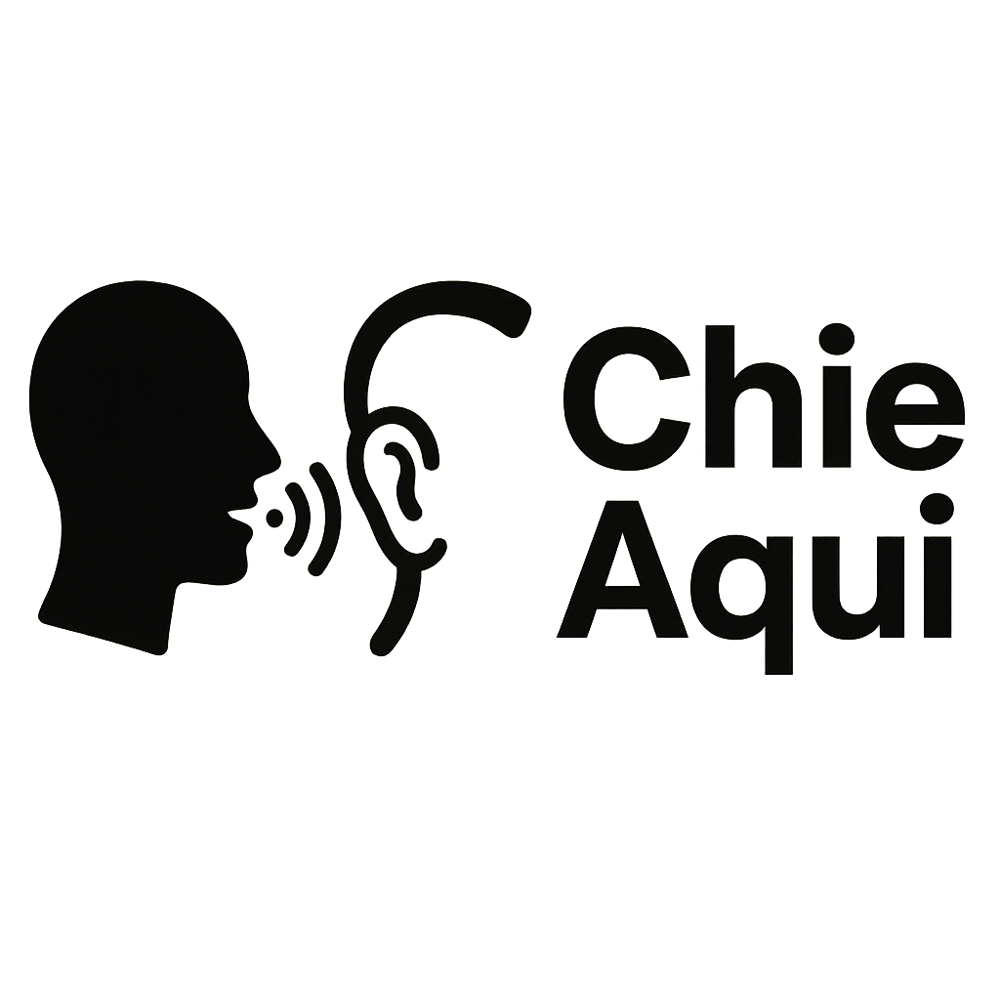
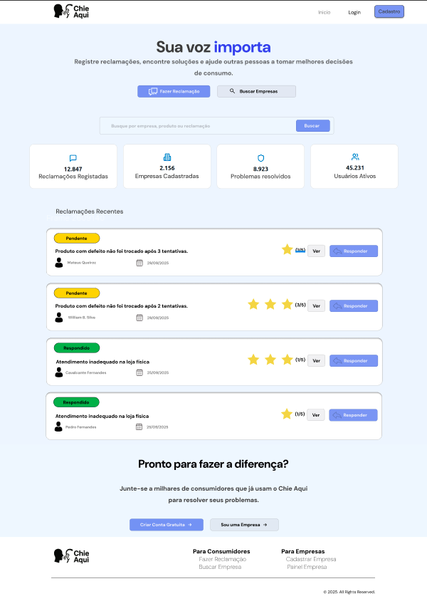

# Chie Aqui

    

## Plataforma de Reclamações Online

O projeto **Chie Aqui** foi desenvolvido foi desenvolvido como um projeto pessoal. O objetivo central é criar uma plataforma online inspirada no "Reclame Aqui", onde consumidores possam registrar reclamações sobre empresas e acompanhar as respostas e soluções oferecidas.  

A proposta busca promover maior transparência e diálogo entre consumidores e empresas, criando um espaço confiável para feedbacks, resolução de problemas e construção de reputação empresarial.  

## 📝 Sumário
- [Chie Aqui](#plataforma-de-reclamações-online)
    - [📝 Sumário](#-sumário)
    - [🚀 Objetivo](#-objetivo)
    - [⚙️ Funcionalidades](#%EF%B8%8F-funcionalidades-previstas)
    - [🤖 Identidade Visual](#-identidade-visual)
    - [🛠 Arquitetura](#-arquitetura)

## 🚀 Objetivo

O **Chie Aqui** busca oferecer uma ferramenta que:
- Facilite o registro de reclamações por consumidores.
- Permita que empresas respondam de forma oficial e organizada.
- Gere confiança por meio da transparência e da acessibilidade.
- Apoie análises e relatórios sobre os principais problemas enfrentados pelos usuários.

## ⚙️ Funcionalidades Previstas

- **Cadastro de Reclamações:** Consumidores podem relatar problemas diretamente na plataforma.  
- **Resposta das Empresas:** Cada empresa pode responder oficialmente às reclamações registradas.  
- **Geração de Estatísticas:** As empresas terão acesso a estatísticas sobre seu desempenho e satisfação do consumidor.  
- **Relatórios Administrativos:** Administradores podem gerar relatórios sobre o uso da plataforma.  

## Identidade Visual

A identidade visual foi pensada para refletir transparência, confiança e facilidade de uso.  
O logo e a paleta de cores trazem tons claros e amigáveis, com destaque em **azul**.  

- *Exemplo da Home:*  
  

## Documentação

A documentação completa do projeto está disponível [aqui](https://chie-aqui.github.io/Chie-aqui_docs/).  

## 🛠 Arquitetura
A arquitetura do projeto pode ser acessada [aqui](https://chie-aqui.github.io/Chie-aqui_docs/arquitetura/arquitetura/).
