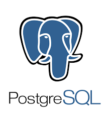

# Tecnologias Utilizadas

## Introdução
O projeto utiliza uma arquitetura moderna separando claramente as responsabilidades entre **backend (API REST)**, **frontend (interface de usuário)**, **banco de dados (persistência)** e **infraestrutura (deployment e gerenciamento)**.

Cada tecnologia foi escolhida para garantir a melhor experiência tanto para desenvolvedores quanto para usuários finais, priorizando ferramentas maduras e amplamente adotadas no mercado.

---
<h2>Tecnologias Utilizadas</h2>

<h3>Introdução</h3>

O projeto utiliza uma arquitetura moderna separando claramente as responsabilidades entre <strong>backend (API REST)</strong>, <strong>frontend (interface de usuário)</strong>, <strong>banco de dados (persistência)</strong> e <strong>infraestrutura (deployment e gerenciamento)</strong>.

Cada tecnologia foi escolhida para garantir a melhor experiência tanto para desenvolvedores quanto para usuários finais, priorizando ferramentas maduras e amplamente adotadas no mercado.

<h3>Backend</h3>
<table>
    <thead>
        <tr>
            <th>Tecnologia</th>
            <th>Imagem</th>
            <th>Descrição</th>
        </tr>
    </thead>
    <tbody>
        <tr>
            <td><strong>Django</strong></td>
            <td>
                
            </td>
            <td>Framework web robusto e amplamente utilizado no desenvolvimento de aplicações em Python. Fornece um conjunto completo de ferramentas integradas, incluindo ORM nativo, sistema de autenticação, administração e segurança.</td>
        </tr>
        <tr>
            <td><strong>Django REST Framework (DRF)</strong></td>
            <td>
                
            </td>
            <td>Biblioteca poderosa para construção de APIs REST com Django. Oferece serialização de dados, autenticação, controle de permissões, paginação e documentação automática. Facilita a criação de endpoints escaláveis e bem estruturados.</td>
        </tr>
    </tbody>
</table>

<h3>Frontend</h3>
<table>
    <thead>
        <tr>
            <th>Tecnologia</th>
            <th>Imagem</th>
            <th>Descrição</th>
        </tr>
    </thead>
    <tbody>
        <tr>
            <td><strong>React</strong></td>
            <td>
                
            </td>
            <td>Framework React completo (Full-stack) que permite renderização do lado do servidor (SSR), geração de sites estáticos (SSG) e roteamento de sistema de arquivos. É otimizado para performance e produção, sendo a base para o desenvolvimento do Frontend.</td>
        </tr>
    </tbody>
</table>

<h3>Banco de Dados</h3>
<table>
    <thead>
        <tr>
            <th>Tecnologia</th>
            <th>Imagem</th>
            <th>Descrição</th>
        </tr>
    </thead>
    <tbody>
        <tr>
            <td><strong>PostgreSQL</strong></td>
            <td>
                
            </td>
            <td>Sistema de gerenciamento de banco de dados relacional de código aberto. Oferece conformidade com padrões SQL, suporte a transações ACID, recursos avançados como índices, views materializadas e extensibilidade através de funções customizadas.</td>
        </tr>
    </tbody>
</table>

<h3>Infraestrutura</h3>
<table>
    <thead>
        <tr>
            <th>Tecnologia</th>
            <th>Imagem</th>
            <th>Descrição</th>
        </tr>
    </thead>
    <tbody>
        <tr>
            <td><strong>Docker</strong></td>
            <td>
                
            </td>
            <td>Plataforma de containerização que permite empacotar aplicações e suas dependências em containers leves e portáteis. Facilita o deployment, escalabilidade e garante consistência entre ambientes de desenvolvimento, teste e produção.</td>
        </tr>
        <tr>
            <td><strong>pgAdmin</strong></td>
            <td>
                
            </td>
            <td>Ferramenta de administração e gerenciamento web para PostgreSQL. Oferece interface gráfica intuitiva para executar consultas SQL, gerenciar usuários, monitorar performance, criar backups e administrar bancos de dados PostgreSQL de forma visual.</td>
        </tr>
    </tbody>
</table>